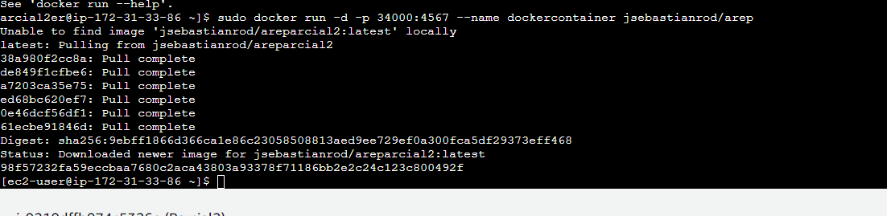

### Juan Sebastian Rodriguez Peña
## Arquitecturas Empresariales Parcial 2

Diseñé, construya y despliegue un aplicación web para investigar la conjetura de Collatz. El programa debe estar desplegado en un microcontenedor Docker corriendo en AWS. LAs tecnologías usadas en la solución deben ser maven, git, github, maven, sparkjava, html5, y js. No use liberías adicionales.

El primer paso a realizar fue crear la docker image y crear el volumen

 

 

Creamos el contenedor y lo ponemos a correr en el puerto 34000 de la maquina

 

 

Revisamos que se haya creado correctamente

 

 
 

 
 Se vera de esta manera

 
Al momento de correr desde la url se vera asi

 
Y desde el index asi...

 

 
Mas pruebas..
 

 
En esta carpeta se encuentra el index

 

 
Realizamos la instalacion de docker y abrimos los puertos necesarios (al final corre en el 42000)

 
Y realizamos las pruebas desde aws

